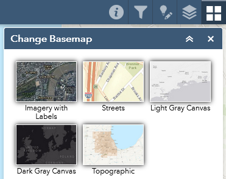

# Getting started

Upon opening the [Development Pipeline Data Inspector](https://cmapgis.maps.arcgis.com/apps/webappviewer/index.html?id=c5566f8d5db34d8da9c1cd839ce13d28) and closing the introductory splash screen, you will see a map of all of the municipalities and unincorporated areas in the region. No development data is displayed when zoomed out this far, so the first step is to select a specific community to zoom in to.

## Zoom to your community

When the map is first opened, the **Filter Data** panel should be visible on the right side of the window. (If it is not, click the icon that looks like a funnel in the upper-right corner.) This panel provides several options for filtering the data to limit the amount of information being displayed, but only the first one, **Zoom to a municipality**, is required. From the dropdown list, select your community. Once a selection has been made, the map will zoom in to show only that municipality and any developments within or near it.

## What am I looking at?

**Municipal boundaries** are represented by orange polygons: 

**Developments** are represented by teal polygons: 

Each development has one or more **components**, represented by icons corresponding to the major land use(s) present in the development:

 

Click on any development outline or component icon to view a pop-up showing information about it. (Note: since the development outlines are based on parcel data which generally does not include rights of way, many developments are represented by “multi-part” polygons that appear to be separate shapes but are in fact a single record.)

By default, the map displays a “topographic” basemap theme, which shows roads, rail lines, water features, parks, airports, and other points of interest. Additional themes are also available via the **Change Basemap** panel to match your preference.

## Apply additional filters *(optional)*

Within the **Filter Data** panel used to select your community, there are four additional filters that you may choose to turn on (using the on/off button to the right of each one). After turning on a filter, each one has an additional dropdown from which a selection must be made.

1. **Filter developments by municipality**: if you only want to view the developments that are specifically within your community, turn on this filter and select your community’s name from the dropdown menu.
1. **Filter components by municipality**: if you only want to view the components that are specifically within your community, turn on this filter and select your community’s name from the dropdown menu.
1. **Filter components by status**: if you only want to view the components with a certain status (e.g. proposed, under construction, completed), turn on this filter and select one or more status types from the dropdown list.
1. **Filter components by land use**: if you only want to view the components with a certain land use (e.g. commercial, industrial, residential), turn on this filter and select one or more land use types from the dropdown list. Note that the filter only includes the major land use types, whereas individual component records also include a more detailed land use type (e.g. single family detached, multi family, mobile homes).

