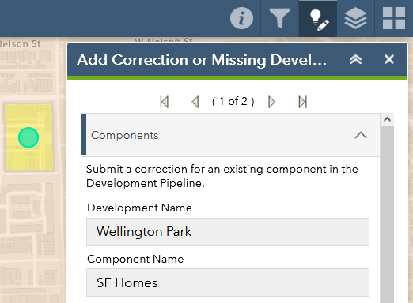

# Submitting changes

When reviewing the development and component records that are already present in the development pipeline data, you may notice out-of-date or inaccurate information. In these cases, we hope you will take the time to let us know what is wrong, so we can improve the accuracy of our data and help ensure that our population and employment forecasts are based on current and correct information.

Please review the [data dictionary](./data-dictionary.html) to see exactly what information is available for developments and components.

## How to submit a correction or update

For both developments and components, the process for submitting a correction is very similar. Once you have identified a necessary change:

1. Open the **Add Correction or Missing Development** panel (by clicking the button in the upper-right corner).
    
    
    
1. On the map, click on the development polygon or component icon with the information that needs updating to select it. Verify that the **Add Correction or Missing Development** panel has been populated with the information from the selected development or component – if you want to edit a component, you may need to use the arrows above the data to switch between the development and the component.
    
    
    
1. Every attribute of the development or component data is displayed, but these are *not editable* and are for reference only. Rather, scroll to the bottom of the list of attributes and describe any corrections in the **Corrections?** box. If there is a website URL you would like to share, please also enter that in the text box.
    
    
    
1. Optionally, please also feel free to upload an attachment with supporting information (e.g. a PDF from the developer, or a photo of the development’s current status)
    
    
    
1. Once you have filled out the **Corrections?** box (and added an attachment, if applicable), make sure to click **Save** in the lower-right corner of the panel. ***If you do not click Save, your corrections will be lost!***
    
    

## Examples of corrections or updates

Examples of updates in the **components** data:

- Component’s *Known Status* is out of date (e.g. it has been completed, but is still listed as being under construction)
- Component’s *Completed Units* is incorrect (e.g. in a new subdivision that will have 100 units upon completion, 20 are listed as completed in CMAP’s data, but in reality 40 units have already been sold and occupied)

Below are some examples of potential errors in the **developments** data:

- Development has wrong *Development Name* or *Primary Developer*
- Development’s *Acreage* or *Former Use* (for redevelopments) is incorrect
- Development exists but is missing a certain component (e.g. a development consisting of an apartment building with ground-floor retail has a development record, but there is no component record for the retail portion of the development). These should be submitted as corrections to the overall development rather than as a correction to an existing component or as a missing development.

Below are some examples of potential errors in the **components** data:

- The sole component within a single-component development has the wrong *Land Use* (e.g. “Single Family Attached” instead of “Single Family Detached”)
- A multi-component development includes a component whose *Land Use* is not actually part of the overall development (e.g. a development that, in reality, consists only of townhomes has two components in the CMAP data: one for townhomes and one for multi-family apartments)
- Component’s *Units* (residential) or *Square Footage* (non-residential) are incorrect. (Bear in mind that *Units* and *Square Footage* are reported separately for each component of a development, so the value for one component in a multi-component development may appear significantly lower than the development’s total.)
- The housing units in a residential component are incorrectly listed as being *Rental Units* and/or *Age-Targeted Units* (e.g. a new condo building is instead listed as a multi-family apartment building with rental units)

The above lists are not exhaustive, but hopefully provide a sense of the types of issues to look for.
