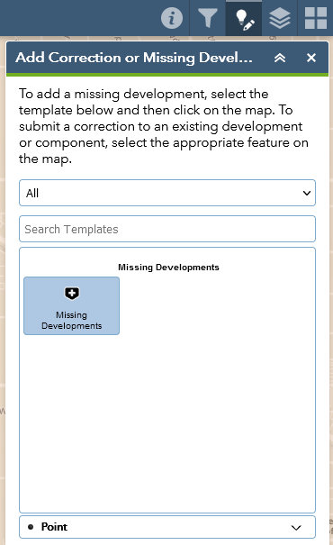

# Submitting missing developments

When reviewing the development and component records that are already present in the development pipeline data, you may find that you are aware of some developments that CMAP has not accounted for. If this is the case, please submit a missing development so that we can improve the accuracy of our data and ensure our population and employment forecasts are based on the most complete information.

CMAP currently only tracks developments that consume at least one acre of land *OR* consist of at least 10 residential units *OR* consist of 10,000 square feet of non-residential space. Additionally, only expansions, new construction, and renovations with a change in land use are tracked (so, for example, condo-to-apartment conversions or vice versa are *not* included).

Note: in cases where a development record exists, but it is missing a component, please [submit a correction](./submitting-corrections.html) for the existing development rather than submitting a missing development.

## How to submit a missing development

For both developments and components, the process for submitting a correction is very similar. Once you have identified an error in CMAP’s data:

1. Open the **Add Correction or Missing Development** panel (by clicking the button in the upper-right corner).
   
    
    
1. Click on the **Missing Developments**  icon within the template selection portion of the panel to activate it.
   
    
    
1. On the map, click the location of the missing development. Verify that the **Add Correction or Missing Development** panel is displaying a blank form for entering details about the missing development.
   
    
    
1. Fill out the form with as much information as possible. Note that only the *Development Name* and *Development Status* fields are required, but any additional information you can provide will be greatly appreciated by CMAP staff – especially the *Website or Description* portion.
   
    
    
1. Optionally, please also feel free to upload an attachment with supporting information (e.g. a PDF from the developer, or a photo of the development’s current status).
   
    
    
1. Once you have finished filling out the **Missing Developments** form (and added an attachment, if applicable), make sure to click **Save** in the lower-right corner of the panel. ***If you do not click Save, your corrections will be lost!***
   
    